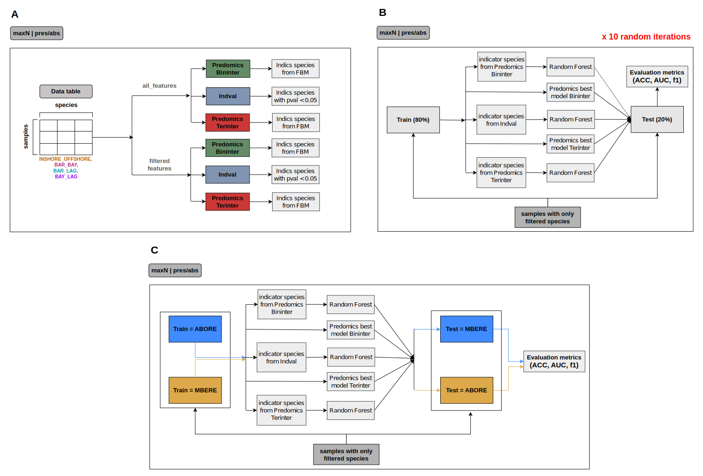

# EcoBruvsML: Machine-learning analyses for marine ecology BRUVS data

## 🧭 Overview

**EcoBruvsML** is a repository for comparative analyses of indicator species (fish species) identification in marine ecology using **Baited Remote Underwater Video  Stations (BRUVS)** dataset.  
The project compares a widely used statistical method in ecology, [**IndVal**], with an interpretable machine learning framework, **Predomics**, to evaluate their effectiveness in identifying ecological indicators from BRUVS data.


## 🌟 Main findings
- Machine learning models from Predomics framework identify a smaller set of of ecologically interpretable indicators than the state-of-the-art IndVal method, which help to make monitoring  more efficient and affordable.
- A strong positive correlation observed between feature importance from Predomics models and the indicator value from IndVal method provides robust evidence that both frameworks capture consistent ecological signals.
- Predomics models show strong generalization performances on unseen data, with potential for wider application in ecosystem monitoring purposes.


## 🔄 Project pipeline 



## ⚙️ Methods

The project pipeline outlines the analyses conducted on the BRUVS dataset from New Caledonia using the following modeling approaches:

- **IndVal**: is a statistical method that computes an indicator value for a species by combining its specificity (fidelity) to a site and its relative abundance within that site. The significance of this indicator is assessed using permutation tests to confirm that the species–site association is not random.
- **Predomics bininter**: is the binary balance models from Predomics framework that identify groups of species whose combined presence or abundance that can classify samples into distinct categories. 
- **Predomics terinter**: is the ternary balance models from Predomics framework that identify two opposing groups of species, where the difference in their combined abundance or presence enables the same type of classification.
- **Random Forest**: is a machine learning model that builds an ensemble of decision trees on training data and aggregates their predictions to classify new, unseen samples.

The analytical framework of the project, as illustrated in the figure above, is structured into three major analyses:

A. **Indicator species identification** was performed with *IndVal*, *Predomics terinter* and *Predomics bininter* on abundance and presence/absence data tables, considering both all fish species (all features) and those present at a minimum 10\% prevalence (filtered features).  
B. **Evaluation of model generalization (train on 80% of samples - test on 20% remaining)** – comparative assessment of model performances on unseen data between *Predomics' terinter and bininter best models*, and *Random Forest models* trained on indicator species identified by IndVal and  Family of Best Models  (FBM) of Predomics terinter and bininter, applied to samples containing only filtered species  
C. **Evaluation of model generalization on replicates** – comparative assessment of model performances on unseen data by Transect (replicates) between *FBM of Predomics' terinter and bininter models*, *Random Forest model*s (trained on indicator species identified by IndVal and FBM of Predomics terinter and bininter models), applied to samples containing only filtered species

## 🐟 Data description

This study uses the dataset collected by [Baletaud et al. (2022)](https://link.springer.com/10.1007/s12526-021-01251-3), which consists of fish community observations from **60 Baited Remote Underwater Video Stations (BRUVS)** deployed in the **Lagoon of Nouméa**, New Caledonia. The dataset was originally designed to evaluate how fish communities vary across distinct marine habitats along an environmental gradient — from **inshore bays** to **offshore barrier reefs**.


### Data overview

| **Feature** | **Description** |
|--------------|-----------------|
| **Location** | Lagoon of Nouméa, New Caledonia |
| **Sampling method** | Baited Remote Underwater Video Stations (BRUVS) |
| **Number of videos** | 60 |
| **Number of habitats** | 3 (Bay, Lagoon, Barrier reef) |
| **Number of transects** | 2 per habitat (Aboré and Mbéré) |
| **Duration per deployment** | 1 hour |
| **Number of species identified** | 148 |
| **Abundance metric** | MaxN (maximum number of individuals observed simultaneously) |
| **Habitat grouping (for analysis)** | Inshore (Bay + Lagoon) vs Offshore (Barrier) |

#### Ecological patterns
- **Species prevalence**: 77% of the observed species were rare or appeared in only a few samples, while 23% showed at least 10% prevalence across sites.  
- **Species richness**: Fish richness varied among habitats, with clear ecological distinctions between inshore (Bay and Lagoon) and offshore (Barrier) communities.  
- **Community structure**: Analyses revealed strong grouping between coastal habitats (Bay and Lagoon), which were distinct from offshore Barrier sites. This justified pooling Bay and Lagoon as **inshore** habitats in subsequent analyses, compared against **offshore** (Barrier) sites for **indicator species identification** using the IndVal and Predomics methods.


## 💾 Data avalaibility 
All processed BRUVS data used for this article are archived in the public repository [Zenodo](https://doi.org/10.5281/zenodo.17283719). The New Caledonian legislation regarding sensitive environmental data does not permit unrestricted public access. Accordingly, access to the data will require a Data Use Agreement (DUA), which will be systematically granted for reproducibility purposes.


## 📁 Repository structure

| Folder | Description |
|--------|--------------|
| `analysis_scripts/` | Contains all the scripts for indicator species identification and evaluation of model generalization analyses |
| `data/` | Provides instructions to get the dataset used in this project |
| `figures/` | Contains all the vizualization with their code as presented in the paper linked to this project |

## 🧩 Install required packages for analyses
```r
# The IndVal method is implemented in the labdsv package

    ## Install labdsv
    install.packages("labdsv")

    ## Load the package
    library(labdsv)

# Install Predomics (from GitHub)

    ## Step 1: Install dependencies
    install.packages("devtools")
    install.packages("gtools")

    ## Step 2: Load devtools
    library(devtools)

    ## Step 3: Install Predomics from the official GitHub repository
    devtools::install_github("predomics/predomicspkg", dependencies = TRUE)

    ## Step 4: (Optional) Install CRAN packages for testing and documentation
    install.packages("testthat")
    install.packages("roxygen2")

    # Step 5: Load the predomics package
    library(predomics)
```


## 🧠 Dependencies

R version: 4.4.2+

## 💰 Acknowledgments

*Funding:* This work was supported by the **AIME (Artificial Intelligence For Marine Ecosystems)** project, co-funded by the **French National Research Agency (ANR)** and the **French Development Agency (AFD)**.

## 📚 Main references

- [*Cutler et al., 2007. Random Forests for classification in ecology. Ecology.*](http://doi.wiley.com/10.1890/07-0539.1)

- [*Dufrene, Marc and Legendre, Pierre, 1997. Species assemblages and indicator species: The need for a flexible asymmetrical approach. Ecological Monographs.*](http://doi.wiley.com/10.1890/0012-9615(1997)067[0345:SAAIST]2.0.CO;2)

- [*Prifti et al., 2020. Interpretable and accurate prediction models for metagenomics data. GigaScience.*](https://academic.oup.com/gigascience/article/doi/10.1093/gigascience/giaa010/5801229)

- [*Baletaud et al., 2022. Baited video reveal fish diversity in the vast inter-reef habitats of a marine tropical lagoon. Marine Biodiversity.*](https://link.springer.com/10.1007/s12526-021-01251-3)
